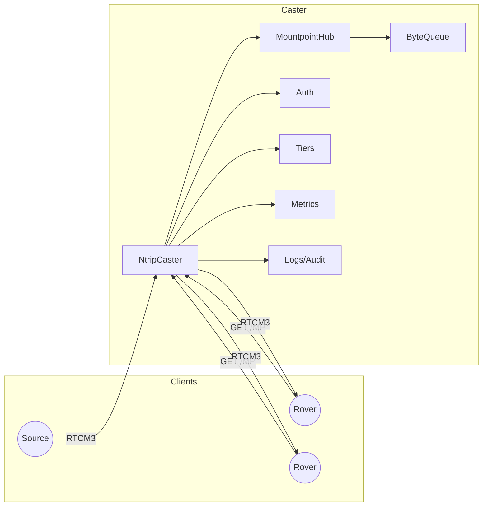
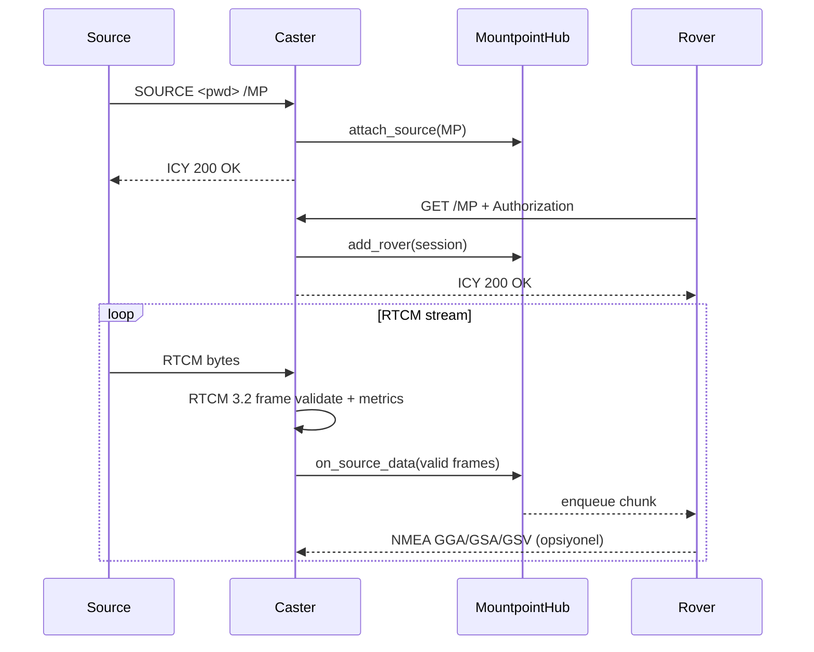
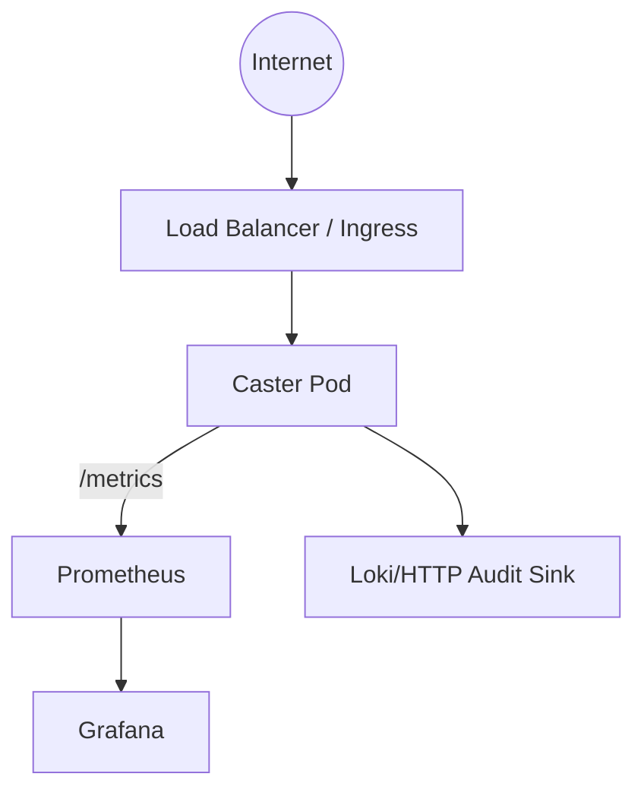

Mimari

Özet
- Asyncio tabanlı NTRIP caster: Source (Base) akışını mountpoint başına tek kabul eder ve Rover (Client) bağlantılarına fan-out yapar.
- Protokoller: SOURCE akışı (NTRIP) + HTTP/ICY GET /MOUNTPOINT.
- QoS: Tier bazlı rate limit (bps), epoch gating ve rover başına sınırlı kuyruk.
- Gözlemlenebilirlik: Prometheus `/metrics`, JSON log alanları, `traceparent` korelasyonu, audit trail.

Universal IoT Gateway
- MQTT Publisher: RTCM frame’leri `gnss/v1/{mountpoint}/stream` topic’ine Protobuf zarfıyla basılır.
- Web API (FastAPI): `security.api_ws_port` üstünde WS/SSE stream + diagnostics uçları sunulur.
- Device Shadow: Redis üzerinde son bilinen durum + konum geçmişi.
- Diagnostics: health/bases/alerts/events; her alert için önerilen aksiyonlar.

Bileşen Diyagramı (Mermaid)

Akış (Sequence)

Dağıtım Diyagramı (Mermaid)

Ölçeklenebilirlik
- Bağlantı modeli: Her TCP bağlantı için asyncio task; mountpoint başına `MountpointHub`.
- Backpressure: Rover başına `ByteQueue` (limitli). Queue dolarsa drop artar ve metrik/loglara yansır.
- Rate limiting: TokenBucket ile kullanıcı tier’ına göre bps limiti; CPU verimli bekleme.
- Yatay ölçekleme: Paylaşımsız state. Çoklu instance için mountpoint bazlı L4 hash yönlendirme önerilir.

Performans Karakteristikleri
- Source->caster->rover fan-out ile toplam çıkış bant genişliği rover sayısı ile artar.
- `listen.backlog` ve `reuse_port` accept performansını etkiler.
- RTCM doğrulama: CRC24Q + frame parse; metrikler ile frame rate/CRC error gözlenir.

Hata Modları ve Etkileri
- Source kopması: Hub tüm rover kuyruklarını kapatır; rover bağlantıları deterministik kapanır.
- Auth başarısızlığı: 401/403 döner; unauthorized sayaçları artar.
- Aşırı yük: Queue dolması → dropped_bytes artışı; alarm/monitoring ile yakalanır.
- Admin kötüye kullanım: IP allowlist + rate limit + audit ile korunur.

Güvenlik Mimarisi
- TLS: Opsiyonel; SOURCE için opsiyonel mTLS (CA ile doğrulama + istemci sertifikası zorunluluğu).
- Admin: Bearer token + IP allowlist + per-IP rate limit; tüm admin işlemleri audit’e yazılır.
- Secret rotation: `env:` ile sırlar; hot-reload ile yeniden okunur.
